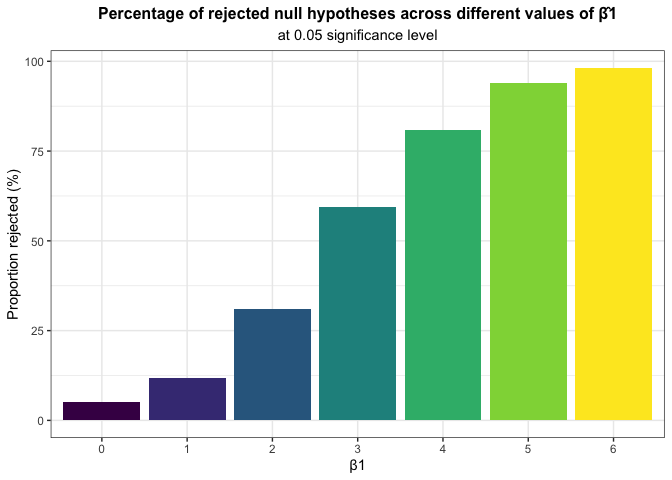
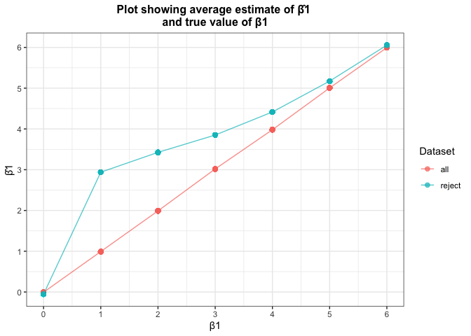

P8105 – Homework 5
================
Ngoc Duong – nqd2000
11/6/2019

``` r
library(readr)
library(tidyverse)
library(ggplot2)
library(purrr)
```

## Problem 1

``` r
#get dataset with missing values 
set.seed(10)

iris_with_missing = iris %>% 
  map_df(~replace(.x, sample(1:150, 20), NA)) %>%
  mutate(Species = as.character(Species)) %>% 
  janitor::clean_names()
```

``` r
# write a function that follows set rules 
rep_func = function(x){                #start function taking column x as argument
  if (is.numeric(x)) {                 #set condition if x is numeric then...
    replace(x,                         #replace in column x...
            is.na(x),                  #values that are NA...
            round(                     #with the average of the other observations that are non NA's
              mean(x, na.rm = TRUE),
              2))
    }
 else if (is.character(x)) {           #set condition if column x is character then...
              replace(x,               #replace in column x...
                      is.na(x),        #values that are NAs...
                      "virginica")     #with "virginica"
}}

iris_imputed = map_df(iris_with_missing, rep_func)  #"map" the function on iris_with_missing using map_df
```

After replacing missing values according to the set rules, a glimpse at
the “filled-in” dataset:

``` r
head(iris_imputed, 10)
```

    ## # A tibble: 10 x 5
    ##    sepal_length sepal_width petal_length petal_width species
    ##           <dbl>       <dbl>        <dbl>       <dbl> <chr>  
    ##  1         5.1          3.5         1.4         0.2  setosa 
    ##  2         4.9          3           1.4         0.2  setosa 
    ##  3         4.7          3.2         1.3         0.2  setosa 
    ##  4         4.6          3.1         1.5         1.19 setosa 
    ##  5         5            3.6         1.4         0.2  setosa 
    ##  6         5.4          3.9         1.7         0.4  setosa 
    ##  7         5.82         3.4         1.4         0.3  setosa 
    ##  8         5            3.4         1.5         0.2  setosa 
    ##  9         4.4          2.9         1.4         0.2  setosa 
    ## 10         4.9          3.1         3.77        0.1  setosa

## Problem 2

``` r
# iterate over file names and read in data for each subject using purrr::map and saving the result as a new variable in the dataframe
file.list =
  tibble(path = list.files(path = "./data",     #use list.files to list all csv file names in data folder
                           pattern="*.csv", 
                           full.names = TRUE))

patient_data =
  file.list %>% 
  mutate(data = map(path, read_csv)) %>%        #use map to apply read_csv to read all file names in (as list), and assign those to column data
  unnest()                                      #unnest list  
```

Now we tidy the dataframe: break file names (path) down into arm and
subject ID, tidy weekly observations, and do any other tidying that’s
necessary

``` r
patient_data_clean = 
patient_data %>% 
  extract(path,                                         #break path character variable down
          regex = "^(.*?)/(.*?)/(.*?)_(.*?)\\.(.*?)$",  #using regular expression specifying "/", "_", and "." as separators
          into = c("A","B","arm", "id", "C")) %>%       #separate into smaller components (some are necessary info; some aren't)
          pivot_longer(
             week_1:week_8,                             #make df longer 
             names_to = "week",                         #collapse 8 week columns into one week column
             values_to = "observation") %>%             #corresponding observations go to variable value
          separate(week, into = c("a","week"), sep = "_") %>% #get the number of week from week column
          mutate(id = factor(id),                       #make factor id and week 
                 week = factor(week),
                 arm =                                  #recode arm variable
                   recode(arm,
                          "con" = "control",
                          "exp" = "experimental")) %>% 
          select(-c("a", "A","B","C"))                  #drop variables that don't give necessary info
```

Make spaghetti plot for observation data

``` r
patient_data_clean %>% 
  ggplot(aes(x = week,                  #set x, y variables and group by arm for ggplot
             y = observation, 
             group = arm, 
             color = arm)) +
  geom_point(size = 2, alpha = 0.5) +   #customize geom points
  geom_path(alpha = 0.7) +              #draw lines (use geom_path)
  labs(                                 #annotate graph
    title = "Data on each subject in control and experimental arm \noberseved over 8 weeks",
    y = "Observation (value)", 
    x= "Week") +
  viridis::scale_color_viridis(discrete = TRUE) + #set viridis color theme
  theme_bw() +                       
  theme(legend.position = "bottom",     #customize annotations
        plot.title = element_text( hjust = 0.5, size=12, face='bold'))
```

<!-- -->

More information on value (observation) is needed to provide more
context. However, looking at the trend in control group, we can see no
difference in the value level from first to eighth week (the overall
trend seems flat), whereas the experimental group shows a positive trend
(increase in observed value going from week 1 to week 8). This indicates
the treatment (provided to the experimental) might work better (or worse
depending on context) than the control group (eithe no treatment or
SOC).

Since experiment and control groups are two independent samples, it’s
not helpful to compare participants with same ID across control and
experimental group. However, breaking down into control/experimental
group and assign color to each subject ID can be helpful in showing how
each participant is responding to the treatment (in the experimental
group), as well as in the control group (if it’s SOC). For instance, in
the plot below, we can see more variability observed at week 1 in the
experimental group versus control, which might indicate the treatment is
initially more effective on certain participants and less on others.

``` r
patient_data_clean %>% 
  ggplot(aes(x = week,              #same as above, but color differentiated by subject ID
             y = observation, 
             group = arm, 
             color = id)) +
  geom_path() + 
  labs(title = "Data on each subject in control and experimental arm oberseved over 8 weeks") +
  viridis::scale_color_viridis(discrete = TRUE) + 
  theme_bw() +
  theme(legend.position = "bottom", 
        plot.title = element_text(hjust = 0.5, size=12, face='bold')) + 
  facet_grid(~arm)                  #two panels by treatment arm 
```

<!-- -->

## Problem 3

``` r
set.seed(7)

sim_regression = function(n = 30, beta0 = 2, beta1) { #make function for with set paramaters "variable" beta1
    sim_data = tibble(                                #tibble with x explanatory variable following normal distribution with mean = 0 and sd = 1
    x = rnorm(n, mean = 0, sd = 1),
    y = beta0 + beta1 * x + rnorm(n, 0, sqrt(50))     #simple linear regression model with beta 
  )
  ls_fit = lm(y ~ x, data = sim_data)                 #fit a linear reg model of y on x 
  broom::tidy(ls_fit)[2,c(2,5)]                       #use broom:tidy to get estimated slope and its p-value for each simple linear regression model
}
```

``` r
sim_results = 
  tibble(beta1 = c(0, 1, 2, 3, 4, 5, 6)) %>%            #start with a 6x1 tibble with true set b1 values 
  mutate(
    output_lists = map(.x = beta1,                      #set values to iterate over as b1
                       ~rerun(100,                   #rerun a demo of 100 estimates per b1
                              sim_regression(beta1 = .x))), #mass apply using function sim_regression defined above
    estimate_dfs = map(output_lists,                 #mass apply bind_rows to output_lists
                       bind_rows)) %>%         
  select(-output_lists) %>%                          #deselect output_lists
  unnest(estimate_dfs)                               #unnest list estimate_dfs to get tibble
```

Find the proportion of null hypotheses that are rejected under
significance level 0.05 (estimate different from 0):

``` r
sim_results %>% 
  filter(p.value < 0.05) %>%              #filter out only p-values less than 0.05 
  group_by(beta1) %>%                     #group by true parameter
  summarize(pct_rej = 100*n()/100)%>%     #create variable pct
  ggplot(aes(x = factor(beta1),           #set variables for x, y axes and by group (beta1)
             y = pct_rej, 
             fill = beta1)) + 
  geom_bar(stat = "identity") +           #create bar graph
  labs(title = "Percentage of rejected null hypotheses across different values of β̂1",
       subtitle = "at 0.05 significance level",
       x = "β1",
       y = "Proportion rejected (%)") +
  viridis::scale_fill_viridis() +         #choose viridis color scheme
  theme_bw() + 
  theme(legend.position = "none",   #customize appearance/annotations
        plot.title = element_text(hjust = 0.5, size=12, face='bold'),
        plot.subtitle = element_text(hjust = 0.5, size=11))
```

<!-- -->

We can see that as effect size (difference between b1 and 0) increases,
the proportion of the times the null hypothesis was rejected (the power)
is higher. In other words, power of the test is positively associated
with effect size. This is because as the population mean under the
alternative hypothesis moves away from the mean under the null, the two
distributions are less overlapped, resulting in lower type II error
(falsely failing to reject the null) and increased
power.

``` r
rej_null_df =                       #create dataset with only rejected null hypotheses
  sim_results %>% 
  filter(p.value < 0.05) %>%        #subset from original dataset with p-value < 0.05
  group_by(beta1) %>%               #group by beta1 to calculate mean of slope estimates
  mutate(avg_est = mean(estimate),  #make new variable for estimate mean (among filtered)
         status = "reject")         #make new variable to indicate status of the slope estimate (different from 0) and estimate mean

original_sim_df =                   #do the same thing as above for original dataset
  sim_results %>% 
  group_by(beta1) %>%  
  mutate(avg_est = mean(estimate),  #same variable as above for estimate mean (among all)
         status = "all")            #same var as above to indicate the estimate mean is for all slope estimates

sim_results_df = rbind(original_sim_df, rej_null_df)  #row bind filtered and original datasets
  
sim_results_df %>% 
  ggplot(aes(x = beta1,                  #set values for x, y axes and group for plot
             y = avg_est,
             colour = status)) + 
  geom_point(size = 2, alpha =  0.7) +   #add points and customize
  geom_line(alpha = 0.7) +               #add line through points and customize
  labs(title = "Plot showing average estimate of β̂1 \nand true value of β1",
       x = "β1",
       y = "β̂1",
       color = "Dataset") +              #add graph and axis title
  theme_bw() + 
  theme(plot.title =                     #customize annotations
          element_text(hjust = 0.5, 
                       size=12, 
                       face='bold')) +
  scale_x_continuous(breaks = seq(0, 6, by = 1)) +  #make interval = 1 on x and y axes
  scale_y_continuous(breaks = seq(0, 6, by = 1)) 
```

<!-- -->

Is the sample average of β̂ 1 across tests for which the null is
rejected approximately equal to the true value of β1? Why or why not?

We can see the averages of slope estimates β̂1 (across all tests) are
close to the true parameter β1. The sample average of β̂1 across tests
for which the null is rejected is closer to the true value of β1 when β1
is much different from 0.

When we take a sample of estimated slopes based on criteria p \< 0.05,
it is not random sampling, and therefore, the sample mean – average of
estimates for each β1– might be biased. This can be observed through how
far off the slope estimates are in the rejected sample from the true
paramater. However, as the parameter increases, β̂1 estimates the
paramater better. This is because the power is large when the effect
size is large, resulting in more (false) nulls being rejected (hence,
very large sample of slope estimates – close to the size of the original
simulation sample), and in this simulation where the OLS assumptions are
satisfied, the estimators are asymptotically unbiased.
